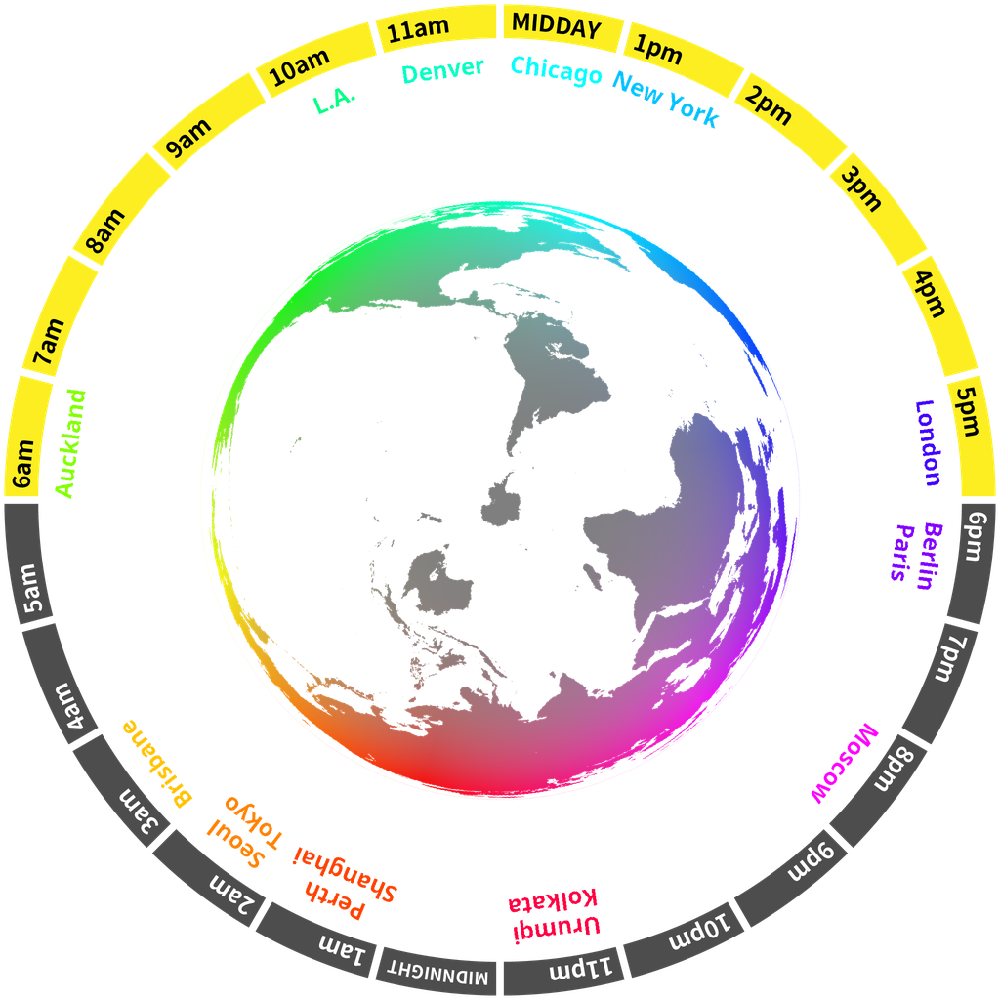

***

<h1 align="center">
Hey there 👋
</h1>

***

I'm Varun. No idea what you're looking for here, but here's some cool stuff anyway.

<h2>
Bio
</h2>

***

I am a med student, so I'm obviously not going to be very active here. However, I've always had a passion for programming, and am currently using and proficient at Docker and K8s.

I've been an avid Python programmer since March 2016, and I rather enjoy the language. I've also dabbled in lower level languages like Rust, C++, and C.

Kotlin/Java are hobbies, but more small-time (no, not Android welp).

<h2>
Contact
</h2>

***
If you ever need to contact me, you can find me through any of these (or the email in my profile):

<table>
<tr>
<th>
<strong>Discord</strong>
</th>
<td>
<a href="https://discord.com/users/411166117084528640">VJ#5945</a> (recommended)
</td>
</tr>
<tr>
<th>GitHub</th>
<td>Well, you're here!</td>
</tr>
<tr>
<th>Twitter</th>
<td><a href="https://twitter.com/darthshittious">@darthshittious</a> (not recommended, I rarely use Twitter)</td>
</tr>
<tr>
<th>Telegram</th>
<td><a href="https://t.me/extremely_slim_shady">here</a> (I do check this fairly often)</td></tr>
</table>

<h2>Work/Projects</h2>

***
A number of my projects are currently closed source until I'm at a stage where I
~~won't be roasted~~ am comfortable with their quality, so not much of a portfolio here,
but I promise I'm good at this stuff.

I'm looking to contribute on C/Rust/Python projects, if you want some bad jokes in your commit messages.

<h2>Skills</h2>

[python]: https://api.iconify.design/logos:python.svg?width=36
[js]: https://api.iconify.design/logos:javascript.svg?width=36
[node]: https://api.iconify.design/logos:nodejs-icon.svg?width=36
[ts]: https://api.iconify.design/logos:typescript-icon.svg?width=36
[rust]: https://api.iconify.design/logos:rust.svg?width=36
[postgres]: https://api.iconify.design/logos:postgresql.svg?width=36
[html]: https://api.iconify.design/simple-icons:html5.svg?width=36&color=%23e96228
[css]: https://api.iconify.design/simple-icons:css3.svg?width=36&color=%232862e9
[go]: https://api.iconify.design/logos:go.svg?width=36&height=36
[c]: https://api.iconify.design/logos:c.svg?width=36
[bash]: https://api.iconify.design/logos:bash-icon.svg?width=36
[svelte]: https://api.iconify.design/logos:svelte-icon.svg?width=36
[tailwind]: https://api.iconify.design/logos:tailwindcss-icon.svg?width=36&height=36
[sass]: https://api.iconify.design/logos:sass.svg?width=36
[vue]: https://api.iconify.design/logos:vue.svg?width=36
[flask]: https://api.iconify.design/logos:flask.svg?width=36
[vscode]: https://api.iconify.design/logos:visual-studio-code.svg?width=36
[pycharm]: https://api.iconify.design/logos:pycharm.svg?width=36
[intellij]: https://api.iconify.design/logos:intellij-idea.svg?width=36
[clion]: https://api.iconify.design/logos:clion.svg?width=36
[sublime]: https://api.iconify.design/logos:sublimetext-icon.svg?width=36
[neovim]: https://api.iconify.design/simple-icons:neovim.svg?width=36&color=%235b9a35
[emacs]: https://api.iconify.design/vscode-icons:file-type-emacs.svg?width=36
[git]: https://api.iconify.design/logos:git-icon.svg?width=36
[redis]: https://api.iconify.design/logos:redis.svg?width=36
[nginx]: https://api.iconify.design/logos:nginx.svg?width=36

<h3>Languages and syntax</h3>

[![python][python]](https://python.org/)
&nbsp;[![Rust][rust]](https://rust-lang.org/)
&nbsp;[![html][html]](https://developer.mozilla.org/en-US/docs/Glossary/HTML5)
&nbsp;[![css][css]](https://developer.mozilla.org/en-US/docs/Web/CSS)
&nbsp;[![javascript][js]](https://developer.mozilla.org/en-US/docs/Web/JavaScript)
&nbsp;[![NodeJS][node]](https://nodejs.org)
&nbsp;[![typescript][ts]](https://typescriptlang.org/)
&nbsp;[![sass][sass]](https://sass-lang.com/)
&nbsp;[![go][go]](https://golang.org/)
&nbsp;[![c][c]](https://en.cppreference.com/w/c)
&nbsp;[![bash][bash]](https://www.gnu.org/software/bash/)

<h3>Frameworks</h3>

[![Svelte][svelte]](https://svelte.dev/)
&nbsp;[![Tailwind][tailwind]](https://tailwindcss.com/)
&nbsp;[![VueJS][vue]](https://vuejs.org)
&nbsp;[![Flask][flask]](https://palletsprojects.com/p/flask/)

<h3>Tools</h3>

[![VSCode][vscode]](https://code.visualstudio.com/)
&nbsp;[![Sublime Text][sublime]](https://www.sublimetext.com/)
&nbsp;[![Neovim][neovim]](https://neovim.io/)
&nbsp;[![Emacs][emacs]](https://www.gnu.org/software/emacs/)
&nbsp;[![pycharm][pycharm]](https://www.jetbrains.com/pycharm/)
&nbsp;[![intellij idea][intellij]](https://jetbrains.com/idea/)
&nbsp;[![clion][clion]](https://jetbrains.com/clion/)
&nbsp;[![Git][git]](https://git-scm.com/)
&nbsp;[![postgresql][postgres]](https://postgresql.org/)
&nbsp;[![Redis][redis]](https://redis.io/)
&nbsp;[![Nginx][nginx]](https://nginx.org/en/)

<h2>Devices</h2>

***

<!-- Styles are ignored in README rendering on GitHub profile but work on GitHub Pages -->
-  `Isengard`
-  `Mordor` - Daily driver
-  `Gondor` - College/music
-  `Shire` - Server host
-  `Rivendell` - Alternate server host
***
This README *dynamically updates* using GitHub Actions every hour.
It last updated at **01-07-2021, 17:01 UTC**.
***

🕔 World clock inspired by <a href="https://xkcd.com/now">XKCD now</a>

> 

🌗 Lunar phase

The moon is approximately 76.03% through its phase (Last Quarter).

&#x1f5bc; Fractal of the hour

> 

&#x23f2; Year percentage bar

<pre><code>2021 [█████████▁▁▁▁▁▁▁▁▁▁▁] 49.78%</code></pre>

